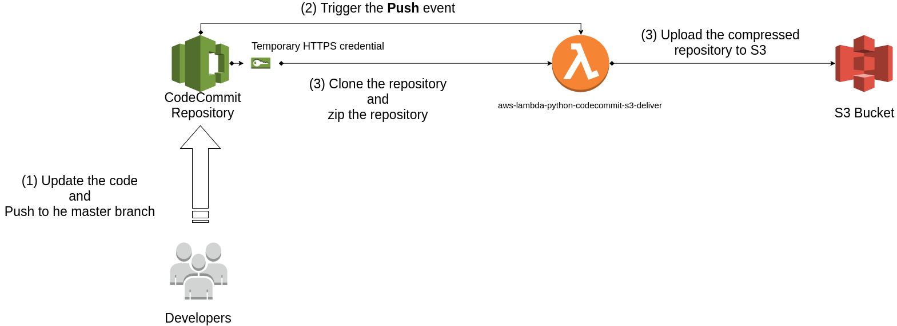
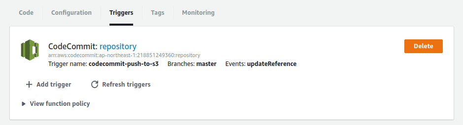
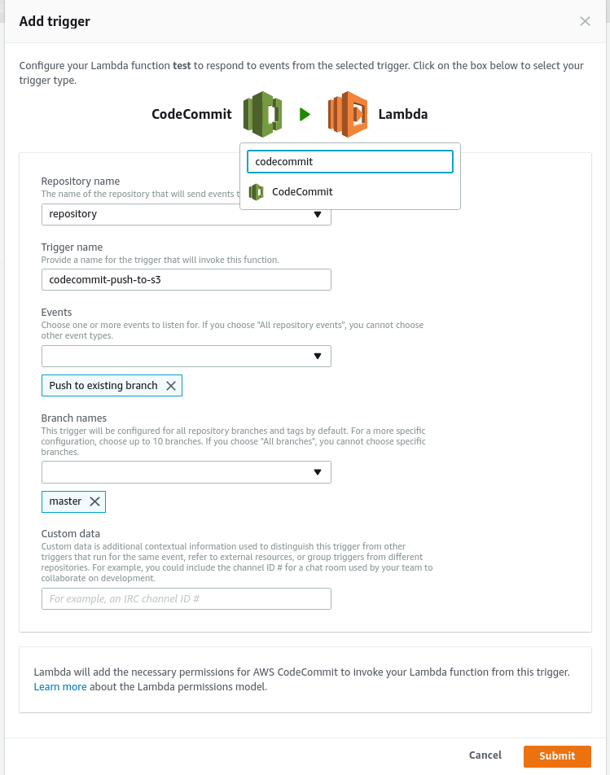
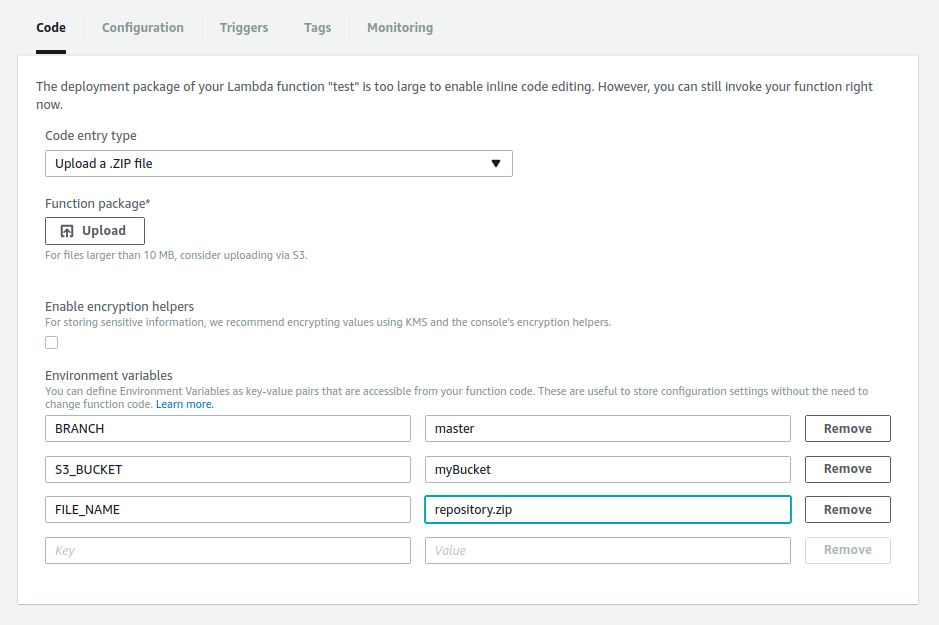
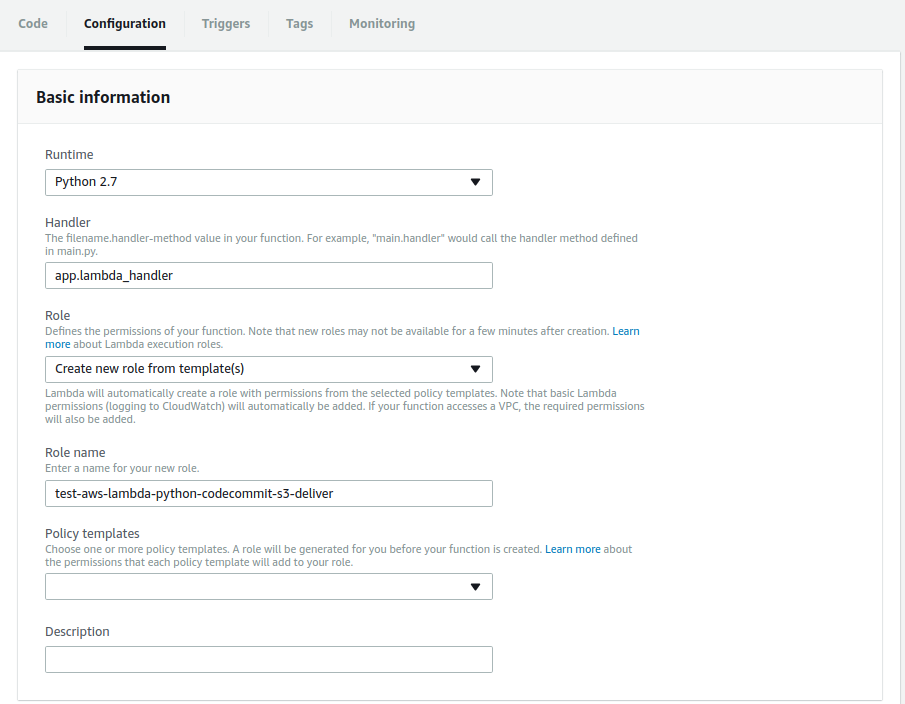
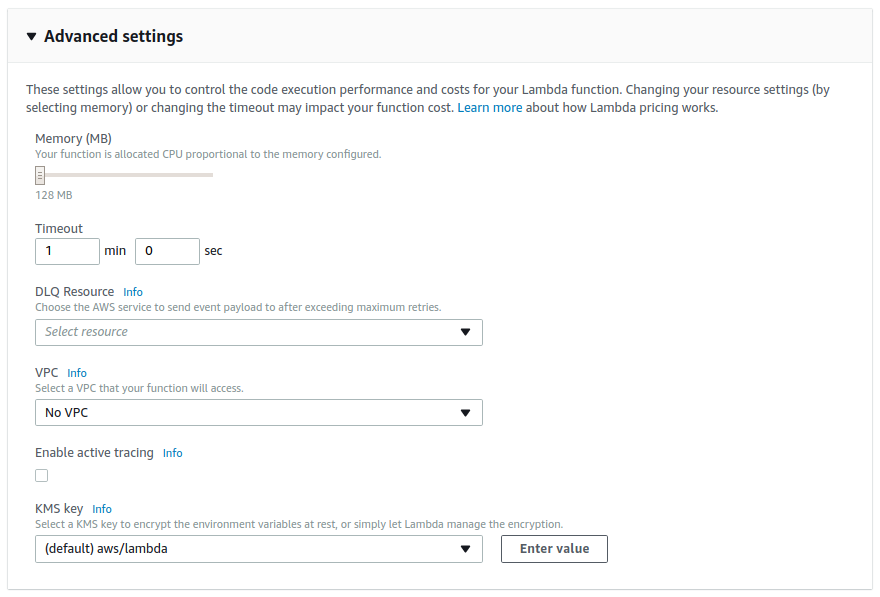
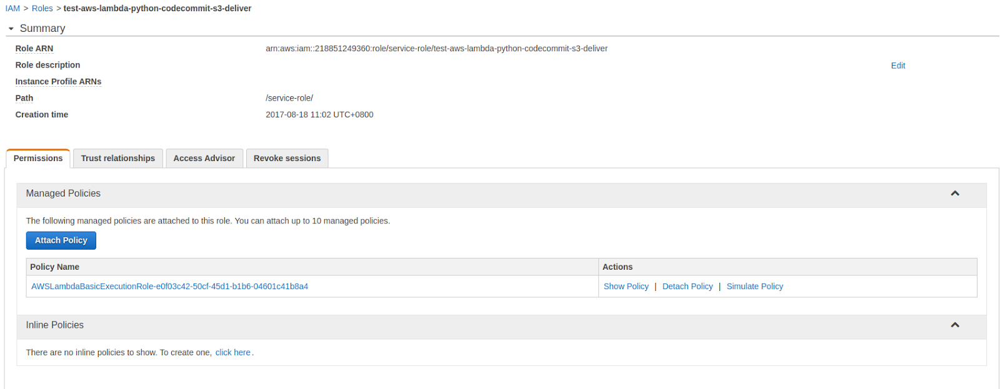
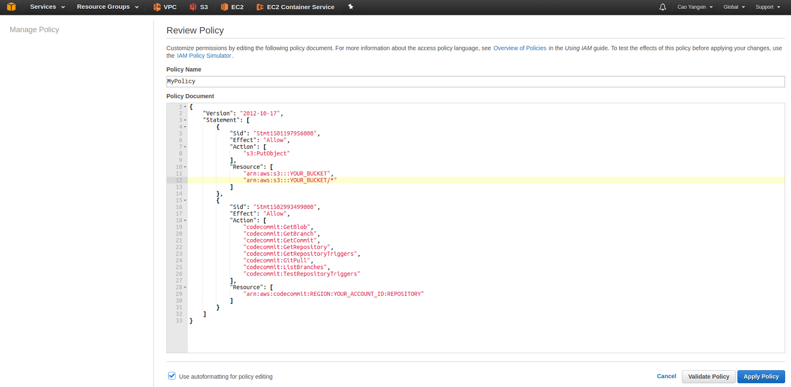
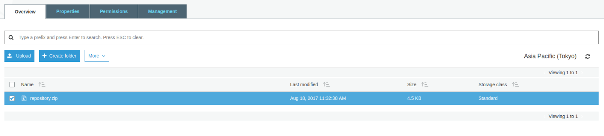

aws-lambda-python-codecommit-s3-deliver
===

This lambda package can automatic pack the CodeCommit repository to S3 bucket.



## Quick start

1. Download the [aws-lambda-python-codecommit-s3-deliver package](https://github.com/0xlen/aws-lambda-python-codecommit-s3-deliver/archive/master.zip)

```bash
git clone https://github.com/0xlen/aws-lambda-python-codecommit-s3-deliver
cd aws-lambda-python-codecommit-s3-deliver/
zip -r aws-lambda-python-codecommit-s3-deliver.zip .
```

2. Go to the [Lambda console](https://ap-northeast-1.console.aws.amazon.com/lambda/home?region=ap-northeast-1#/create/configure-function) and create a Lambda function

3. Add an trigger by clicking the **Add trigger button** as the following example



Next, set up your
- **Repository name**
- **Trigger name**
- **Events**: Push to existing branch
- **Branch names**: master (Or you may want to use other branch)



4. In the tab `Code`, select **Upload a .ZIP file** and upload the  [aws-lambda-python-codecommit-s3-deliver package](https://github.com/0xlen/aws-lambda-python-codecommit-s3-deliver/archive/master.zip).



5. In the **Environment variables**, please set up your repository, branch and S3 bucket information                                                  

| Name        | Type              | Description                                                                       |
| ----------- | ----------------- | ----------------------------------------------------------------------------------|
| BRANCH      | string(required)  | The pulling branch the lambda function is triggered.                              |
| S3_BUCKET   | string(required)  | Specify the S3 bucket will put the compressed repository file.                    |
| FILE_NAME   | string(required)  | The compressed repository file name.                                              |

6. In the `Configuration` tab, please use the following settings.

- Runtime: Python 2.7
- Handler: app.lambda_handler



7. In the **Advanced settings**. If your repository is need to pull for a long while, please increase your **Timeout**. In my use case, my Timeout is 1 min.



8. In the **Role**, select **Create a new IAM Role from template**
9. Save the lambda function. Go to the [IAM Role Console](https://console.aws.amazon.com/iam/home?#/roles)
10. Please select the Lambda IAM Role created before.



11. Add the inline policy below

IAM Policy

```json
{
    "Version": "2012-10-17",
    "Statement": [
        {
            "Sid": "Stmt1501197956000",
            "Effect": "Allow",
            "Action": [
                "s3:PutObject"
            ],
            "Resource": [
                "arn:aws:s3:::YOUR_BUCKET",
                "arn:aws:s3:::YOUR_BUCKET/*"
            ]
        },
        {
            "Sid": "Stmt1502993499000",
            "Effect": "Allow",
            "Action": [
                "codecommit:GetBlob",
                "codecommit:GetBranch",
                "codecommit:GetCommit",
                "codecommit:GetRepository",
                "codecommit:GetRepositoryTriggers",
                "codecommit:GitPull",
                "codecommit:ListBranches",
                "codecommit:TestRepositoryTriggers"
            ],
            "Resource": [
                "arn:aws:codecommit:ap-northeast-1:YOUR_ACCOUNT_ID:YOUR_CODECOMMIT_REPOSITORY"
            ]
        }
    ]
}
```

Here is what it looks like, click **Apply policy**




## Test

Now this lambda function would be triggered when the CodeCommit is having the Push event. You can check the .zip file in your S3 bucket after any new push event.

```
git push -u origin master
```

You will see the compressed repository is automatically generated by the lambda function.


